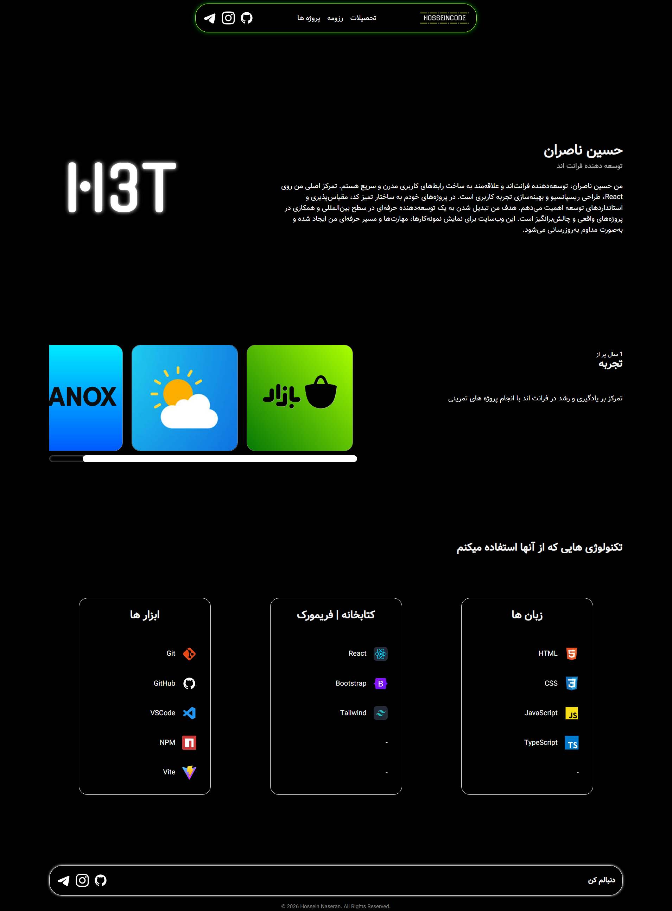

# Personal Portfolio Website

A responsive personal portfolio website built with HTML, CSS, and JavaScript to showcase my projects, skills, and frontend development journey.

## Live Demo

🔗 https://hosseinnaseran.github.io/Hossein

## Features

- Responsive layout
- Smooth scrolling navigation
- Modern and clean UI
- Project showcase section
- Contact section

## Tech Stack

- HTML5
- CSS3
- JavaScript
- Git

## Preview

## Purpose

- Practice frontend development
- Build a professional portfolio
- Showcase projects and skills
- Improve responsive design techniques

## Project Status

Actively maintained and continuously improved.

## 👨‍💻 Author

**Hossein Naseran**

- [GitHub](https://github.com/HosseinNaseran)
- [LinkedIn](https://www.linkedin.com/in/hosseinnaseran)

If you found this project helpful, consider giving it a ⭐ on GitHub.

